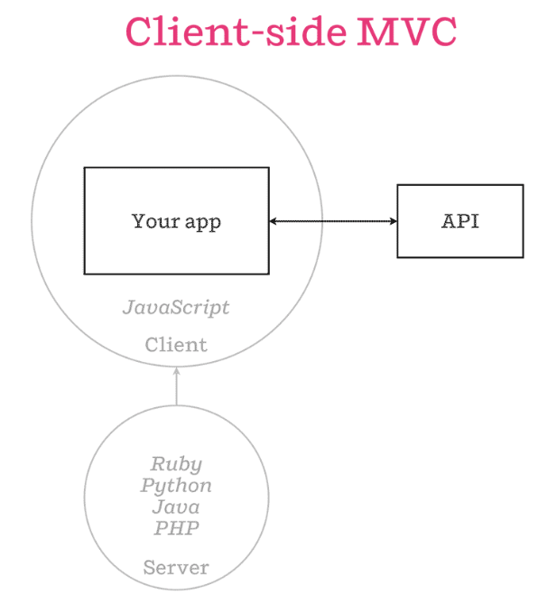
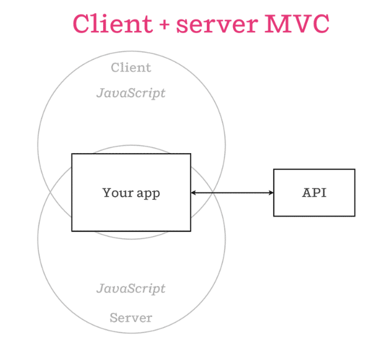

# Isomorphic JavaScript: The Future of Web Apps

## 요약

왜 SPA의 시대가 도래했는지, SPA의 장점이 무엇인지에 대해서는 너무 많이 복기했으므로 생략하고, 이 글에서 중점적으로 논하고 싶어하는 문제도 아니므로 생략.

전통적인 SPA는 위와 같은 아키텍처로 주로 작성된다. 위와 같은 구조를 사용하면서 생긴 몇가지 문제가 있는데, 그것이 다음과 같다.

* SEO: 당연히 html을 내려주므로 취약함
* Perfomance: 첫 유입시 렌더링 시간이 필요해 UX가 망가짐
* Maintainability: server-side와 client-side 사이에 몇 몇 중복코드가 생기는데 (예를 들면, date formatting 등), 이것이 코드 유지에 큰 비용을 일으킴

이를 해결하기 위해 생각해낸 것이 isomorphic javascript인데, 기본적인 아키텍쳐는 아래의 사진과 같다.

즉, 핵심 아이디어는 clien와 server 모두에서 돌아가는 코드를 작성하므로서 위의 문제들을 해결할 수 있다는 것이다. 이는 Node.js가 등장하고 성숙한 프로젝트가 되어감에 따라 실현되고 있다.

* SEO, Perfomance:  text로 직접 서버사이드에서 미리 렌더링하여 client에게로 내려준다
* Maintainablity: Server와 client 모두 같은 코드를 돌리므로, webpack 등의 번들 시스템을 통해 중복을 제거해 유지보수를 잘 할 수 있음

더불어 이를 실제로 구현하고 있는 여러 프로젝트도 소개한다.

* Meteor
* Asana
* Rendr

## TODO

다음에 프로젝트 할 일 있으면 meteor 써봐야겠다.