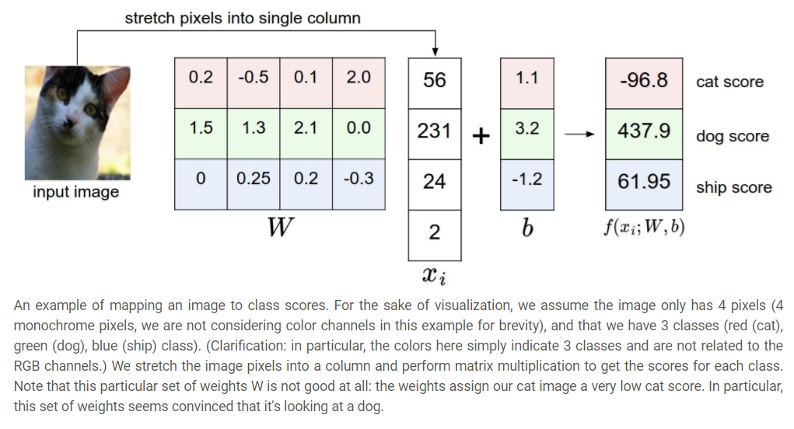
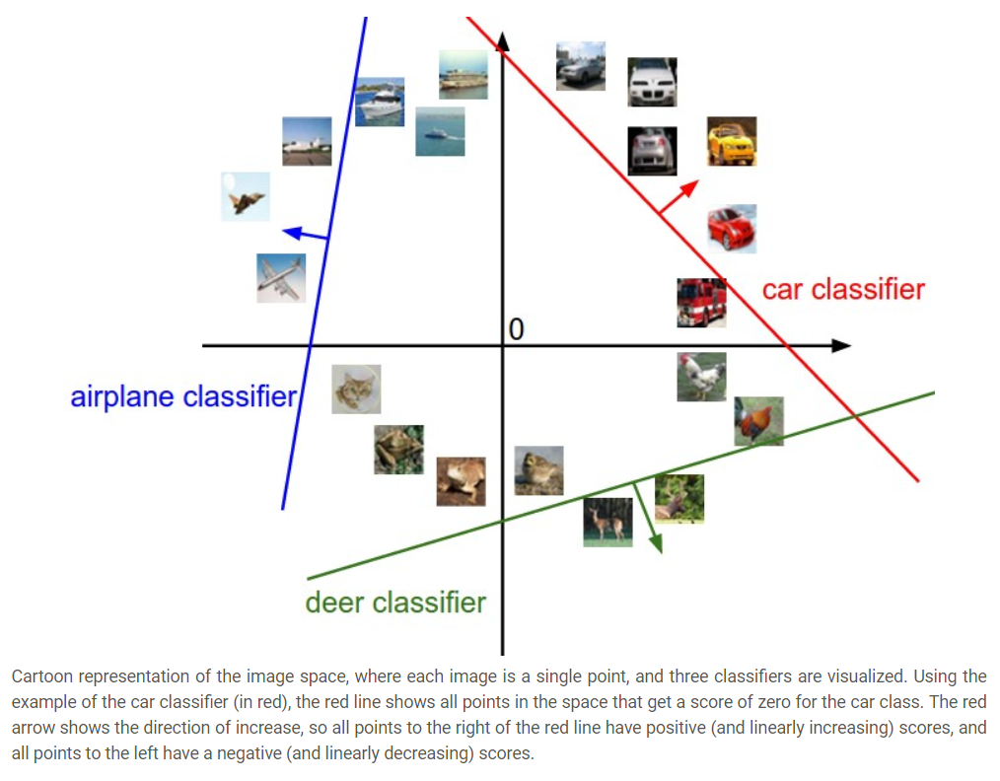
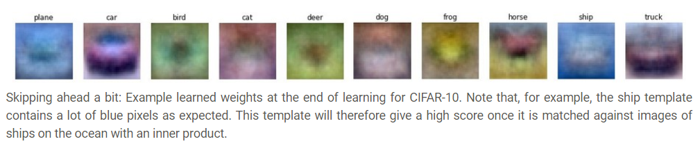

# Linear Classification

### 개요

이 글은 cs231n의 참고자료이며, Linear Classification을 다루며 *score function*과 *loss function*의 내용을 설명하지만 사실 대부분의 내용은 loss function인 **Multiclass Support Vector Machine loss**와 **Cross-entropy loss**의 개념과 차이점에 관한 것이다.

* score function: input raw data를 class score로 mapping하는 함수
* loss function: predicted score와 ground truth가 얼마나 동일한지를 나타내는 척도

### Linear Classification의 해석

#### 0. Linear Classification

#### 1. Analogy of Images as High-demensional points

image를 하나의 점으로 보면 Linear Classification의 결과는 이 점들을 나누는 직선으로 볼 수 있다. (typical한 해석이므로 더이상의 설명은 생략)

#### 2. Interpretation of Linear Classifiers as template matching 

**W**의 각 row는 해당 class의 *template(=prototype)*에 해당하며 score of class를 계산한다는 것은 이 template과 data를 inner product를 통해 비교한다는 것. 

즉, 우리는 Nearest Neighbor를 template을 이용해 효율적으로 수행하는 것과 같다는 의미이다. 이때 우리가 사용하는 distance는 L1이나 L2 distance가 아니라 negative inner product이다. 

위의 사진을 보면 horse같은 경우에 양방향의 머리를 가진 말처럼 보이는데, 이는 두 방향의 말을 모두 찾기 위해서이다. ship같은 경우에도 주위가 바다인 경우가 많아 테두리가 파란색이다.