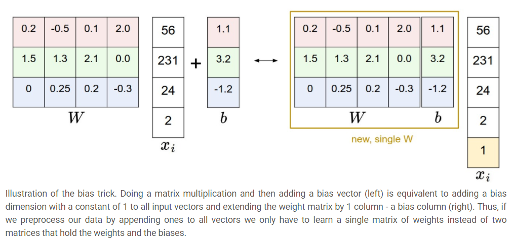
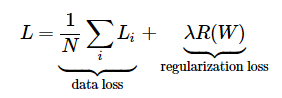
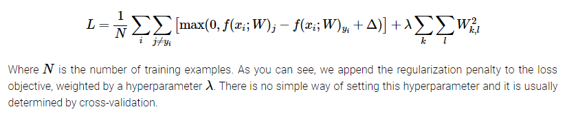

# Linear Classification

### 개요

이 글은 cs231n의 참고자료이며, Linear Classification을 다루며 *score function*과 *loss function*의 내용을 설명하지만 사실 대부분의 내용은 loss function인 **Multiclass Support Vector Machine loss**와 **Cross-entropy loss**의 개념과 차이점에 관한 것이다.

* score function: input raw data를 class score로 mapping하는 함수
* loss function: predicted score와 ground truth가 얼마나 동일한지를 나타내는 척도

### Linear Classification

#### 0. Linear Classification

#### 1. Analogy of Images as High-demensional points

image를 하나의 점으로 보면 Linear Classification의 결과는 이 점들을 나누는 직선으로 볼 수 있다. (typical한 해석이므로 더이상의 설명은 생략)

#### 2. Interpretation of Linear Classifiers as template matching 

**W**의 각 row는 해당 class의 *template(=prototype)*에 해당하며 score of class를 계산한다는 것은 이 template과 data를 inner product를 통해 비교한다는 것. 

즉, 우리는 Nearest Neighbor를 template을 이용해 효율적으로 수행하는 것과 같다는 의미이다. 이때 우리가 사용하는 distance는 L1이나 L2 distance가 아니라 negative inner product이다. 

위의 사진을 보면 horse같은 경우에 양방향의 머리를 가진 말처럼 보이는데, 이는 두 방향의 말을 모두 찾기 위해서이다. ship같은 경우에도 주위가 바다인 경우가 많아 테두리가 파란색이다.

### 3. Bias trick

#### 4. Image Data Processing

이미지 데이터를 다룰 경우 zero mean centering (range [-1, 1])로 해주는 것이 좋다. 이는 이후에 배울 gradient descent의 동작을 배우면 알 수 있음.

### Loss function

* loss function = const function = object function = objective

#### 1. Multiclass Support Vector Machine loss(SVM loss)

SVM loss는 간단히 말하면 정답인 class의 score가 정답이 아닌 class의 score보다 적어도 일정 크기($$Δ$$)만큼은 더 크기를 바란다. 

좀 더 자세히 알아보도록 하자. i번째 데이터를 $$x_i$$와 $$y_i$$라고 하자. 이때 score function으로 구한 score vector를 $$s$$라고 하고 j번째 클래스의 score는 $$s_j$$라고 하자. 즉, $$s_j=f(x_i, W)_j$$이다. 그러면 i번째 데이터에 대한 SVM loss는 다음과 같이 정의된다.

SVM loss 중 hinge loss: $$Li=∑_{j≠yi}max(0,s_j−s_{y_i}+Δ)$$

**예제**

$$s=[13,−7,11]$$이고 $$y_i=0$$, $$Δ$$=10 이라면

$$L_i=max(0,−7−13+10)+max(0,11−13+10)$$

이때, 첫번째 term의 경우 $$s_1$$와 $$s_0$$의 차이가 $$Δ$$보다 더 크기 때문에 penalty가 0이 되지만 두번째 term의 경우 $$s_2와 s_0$$의 차이가 $$Δ$$보다 더 작기 때문에 penalty를 받게 된다.

간단히 말해 SVM loss는 incorrect class의 score가 correct class의 score보다 적어도  $$Δ$$만큼은 작기를 바란다.

참고로 hinge loss와는 다르게 $$max(0, -)^2$$으로 계산하는 squared hinge loss도 존재.

#### Regularization

모든 example에 대해 제대로 classify를 수행하는 $$W$$를 찾았다고 하자. 그런데 이 $$W$$는 unique하지 않다. 예를 들어 $$λW where λ>1$$이면 전부 제대로 classify한다고 볼 수 있다. 왜냐면 $$max(0, λ * -)$$이므로.

그렇다면 많은 $$W$$중에 어떤 것이 가장 좋을 것일까? loss function을 디자인할 때, 이런 preference도 **Regularization penalty** $$R(W)$$로 포함해주게 된다. 가장 유명한 것은 아래와 같은 **L2 norm**

$$R(W)=∑_k∑_lW_{k,l}^2$$

보면 알다시피 이런 Regularization loss는 데이터와는 상관없이 오직 $$W$$와만 관계된다.

위의 Regularization을 고려하면 **full SVM loss**는 아래와 같다.

혹은 풀어쓰면

Regularization을 사용하면 부가적으로 아래와 같은 특징이 생긴다.

* penalizing을 하는 것 만으로 generatlization 능력이 증가한다. 예를 들어, $$x=[1, 1, 1,1]$$이고 $$W_1=[1, 0, 0, 0]$$이고 $$W_2=[0.25, 0.25, 0.25, 0.25]$$가 있다면 inner product를 하면 같은 결과를 내므로 data loss는 같지만 regularzation loss는 $$W_1$$이 더 크므로 우리는 $$W_2$$를 선호하게 된다. 이는 하나의 feature에 너무 큰 가중치를 주지 않고 모든 feature들을 두루 참고한다는 뜻이다.
* 실전에서는 큰 차이가 없지만 bias는 원래 penalize 대상이 아니다. 이 값들은 input demension(feature)의 strength에는 영향을 미치지 못하기 때문이다.
* 마지막으로 모든 weight가 0이 될 수는 없으므로 loss는 결코 정확히 0이 될 수 없다.

#### Practical Consideration

1. **Setting Delta**

